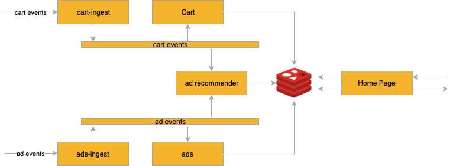

# shopping-demo

## Summary

This is a sample demonstration of projectriff, in which we create a simple shopping cart.
User actions such as adding and removing items arrive as input. These events are then used
to compute the final state of the cart and display targeted advertisements.

## Architecture



1. cart-ingest: An application that accepts CartEvents (items added/removed from cart) enriches and publishes them to the cart-events stream
1. cart: A function that processes the cart-events stream to compute a materialised view of the cart for each user and stores this cart in Redis.
1. ads-ingest: An application that accepts AdEvents (new listings of ads, updating existing ads with related items) enriches and publishes them to
the ads-events stream.
1. ads: A function that processes the ad-events stream to compute a materialised view of the ads for each item and stores it in Redis.
1. ad-recommender: A function that processes cart-events and ad-events to generate the personalised ads to be displayed for each customer and stores it in Redis. Only implements two rules currently:
    * If an item is removed, display an ad for it.
    * If an item is added display ad for related item.
1. Homepage: An application that serves the cart and ads to the user.

## Prerequisites

1. install [helm 2.13](https://github.com/helm/helm/releases/tag/v2.13.1) cli
1. initialize helm
    ```sh
    kubectl create serviceaccount tiller -n kube-system
    kubectl create clusterrolebinding tiller --clusterrole cluster-admin --serviceaccount kube-system:tiller
    helm init --wait --service-account tiller
    ```
1. add projectriff helm repo:
    ```sh
    helm repo add incubator http://storage.googleapis.com/kubernetes-charts-incubator
    helm repo update
    ```
1. install riff with core and streaming runtimes
    ```sh
    helm install projectriff/riff --name riff --set riff.runtimes.core.enabled=true --set riff.runtimes.streaming.enabled=true --devel
    ```
1. install kafka:
    ```sh
    helm repo add bitnami https://charts.bitnami.com/bitnami
    helm install --name my-kafka bitnami/kafka
    ```
1. setup kafka provider:
    ```
    cat <<EOF | kubectl create -f -
    ---
    apiVersion: streaming.projectriff.io/v1alpha1
    kind: KafkaProvider
    metadata:
      name: franz
    spec:
      bootstrapServers: my-kafka:9092
    EOF
    ```
1. install riff HTTP gateway:
    ```
    kubectl apply -f https://storage.googleapis.com/projectriff/riff-http-gateway/riff-http-gateway-0.5.0-snapshot.yaml
    ```
1. configure a container registry for riff to push built images:
    ```sh
    riff credentials apply my-gcr --gcr <path to service account token file> --set-default-image-prefix
    ```
